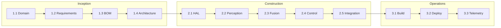

# AWS AI-DLC 개발 프로세스

## AI-DLC 개요

AI-DLC(AI-Driven Development Life Cycle)는 AWS가 제안한 방법론으로,
**AI가 계획·구현을 제안하고 사람이 검증**하는 Human-in-the-loop 개발 프로세스다.

> AI proposes, human validates.

## 3단계 Phase

| Phase | 목적 | 주요 산출물 |
|-------|------|------------|
| **Inception** | 요구사항, 아키텍처 | User Stories, 도메인 모델, BOM |
| **Construction** | 설계, 구현, 테스트 | Go 코드, 단위 테스트 |
| **Operations** | 배포, 모니터링 | systemd, AWS IoT, CloudWatch |

## Bolt (작업 단위)

전통적 Sprint 대신 **Bolt** — 몇 시간~며칠 단위의 집중 작업 사이클.

### Inception Bolts

| Bolt | 상태 | 산출물 |
|------|------|--------|
| 1.1 도메인 정의 | ✅ | `docs/02-requirements.md` |
| 1.2 요구사항 명세 | ✅ | User Stories, NFR |
| 1.3 하드웨어 BOM | ✅ | `docs/03-hardware.md` |
| 1.4 아키텍처 | ✅ | `docs/04-architecture.md` |

### Construction Bolts

| Bolt | 상태 | 산출물 |
|------|------|--------|
| 2.1 HAL (mock) | ✅ | `internal/hal/mock.go` |
| 2.1 HAL (hardware) | ✅ | `internal/hal/*_linux_arm.go` |
| 2.2 Perception | ✅ | `internal/perception/` |
| 2.3 Fusion | ✅ | `internal/fusion/` |
| 2.4 Control | ✅ | `internal/control/` |
| 2.5 Integration | ✅ | `cmd/zerodriver/` |

### Operations Bolts

| Bolt | 상태 | 산출물 |
|------|------|--------|
| 3.1 Cross-compile | ✅ | `deploy/build-arm.sh` |
| 3.2 systemd | ✅ | `deploy/zerodriver.service` |
| 3.3 AWS IoT | ✅ | `internal/telemetry/` |

### Field Test Bolts

| Bolt | 상태 | 산출물 |
|------|------|--------|
| 4.1 진단 도구 | ✅ | `cmd/{imutest,camtest,motortest,lidartest,hwtest}` |
| 4.2 실기 E2E | ⬜ | Pi Zero W 주행 검증 |
| 4.3 PID 튜닝 | ⬜ | 실측 게인 최적화 |

## Human Validation Gate

각 Bolt 완료 시 다음을 검토한다:

1. **요구사항 충족** — User Story 인수 조건
2. **아키텍처 일관성** — 패키지 의존성 방향
3. **테스트 통과** — `go test ./...`
4. **문서 동기화** — docs/ 업데이트

## Cursor AI Steering

`AGENTS.md`에 프로젝트 규칙을 정의하여 AI 에이전트가 일관된 코드를 생성하도록 한다.

- Go 1.22+, 표준 라이브러리 우선
- `internal/` 패키지는 외부 import 금지
- HAL은 interface + mock/real 구현
- 모든 공개 함수에 단위 테스트

## 진행 흐름

## 다음 Bolt

**Bolt 4.2~4.3 (Field Test)** — Pi Zero W 실기 주행 검증.
- `docs/09-field-test.md` 절차 따라 hwtest → 주행 테스트
- PID 게인 실측 튜닝
